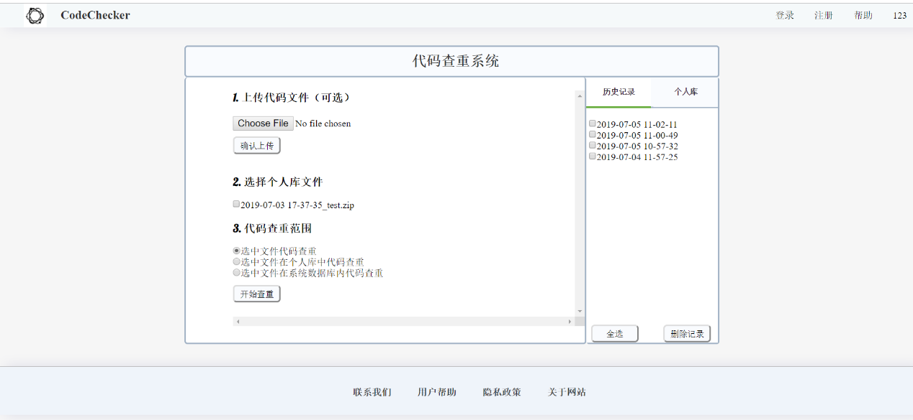
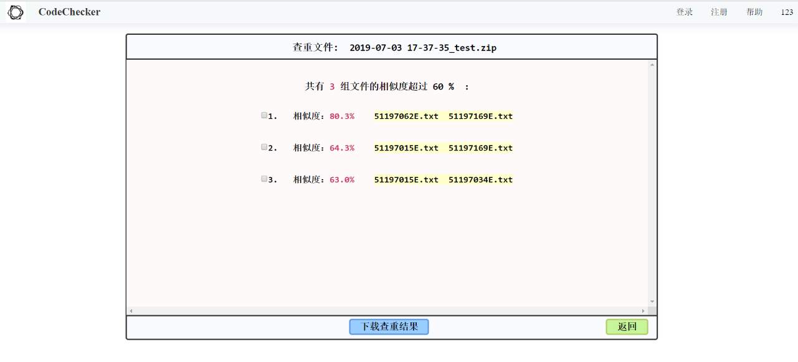
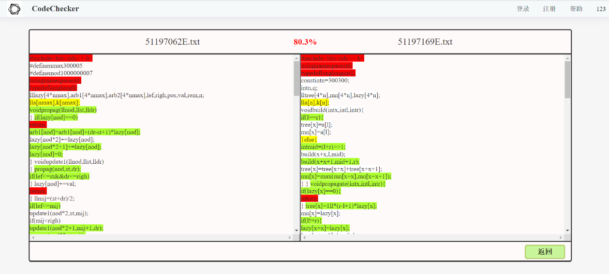

# 代码查重系统

## 三级查重算法

| **算法等级** | **算法名称**                | **算法特点**                                             |
| ------------ | --------------------------- | -------------------------------------------------------- |
| 一级         | 最长公共子序列算法          | 能够识别代码文件对中完全相同的部分                       |
| 二级         | Winnowing算法和属性度量算法 | 能够从结构和特征两个角度，发现代码文件对中非常相似的部分 |
| 三级         | 神经网络算法                | 能够学习代码文件对的更多特征，找出其中比较相似的部分     |

## 系统主要功能

1. 账号注册与账号登录：

   用户可在系统中注册账号，并使用注册过的账号登录系统。

2. 管理个人数据库：

   用户拥有自己的个人数据库，简称为个人库，该库可用于存储对应用户上传过的全部文件；用户可对个人库中的文件进行添加、删除、下载等操作。  

3. 上传代码文件并选择文件查重范围

   用户可上传单个代码文件或压缩包。用户可只上传文件，不进行查重。若用户需要查重，可选选项包括：上传的压缩包内部代码自查重、压缩包内代码文件与个人库内文件两两查重、压缩包内代码文件与系统数据库内文件两两查重。

4. 查看并下载查重结果

   在查重结束后，用户可查看所有的相似文件列表，以及每对相似文件的相似度和相似部分。用户可下载查重结果，其中包含了所有的相似代码文件及查重分析报告。

5. 查看查重历史

   用户可查看自己的全部查重历史，查重历史按照时间顺序由近到远排列，点进任意一个查重历史链接可重新查看或下载当时的查重结果。

该系统中管理员账号主要负责管理全部数据，包括用户账号信息管理、用户个人库管理、系统数据库代码文件分类管理等工作。

## 系统数据库来源

1. 代码提取

   首先从一家为计算机爱好者提供在线评测的系统Codeforces上，通过Python爬虫获取了关于5道题的共计1136份C++代码文件。

2. 代码筛选

   在获得代码集之后，需要对其进行筛选，以剔除不适合训练的极端数据，同时减轻下一步人工比对的工作量。

   首先，计算代码集平均代码长度，记为N，剔除代码长度小于2/N、大于N的数据。其次，考虑到采用的是分级的代码查重策略，只有前两级算法计算相似度较低的代码数据，才会进入第三级进行基于神经网络的检测。所以需要通过第一、二级算法筛掉代码集中的一些数据。最后将经过筛选得到的代码集用于神经网络的训练。

3. 人工比对

   由于神经网络是监督学习算法，所以需要对得到的代码集“加标签”，即标注成对代码文件的相似度。组内成员对这些实验代码文件进行了两两比对，标注位于(0,1)区间内的代码相似度的数值。

4. 特殊数据生成

   经过人工比对后发现，大部分代码的相似度较低，有抄袭可能性的数据很少，这不利于神经网络的训练。因此编写相关代码，自动生成一些相似度较高，但仍能通过前两级算法的代码对，便于神经网络的训练。

## 系统主要页面

### 查重界面

查重界面主要实现上传文件、选择查重范围、管理个人库、查看历史查重记录等功能。用户可上传单个代码文件或压缩包，并选择三种类型的查重范围或者不查重。用户可从界面右侧进入历史记录栏，点击链接查看以往的查重结果；也可以进入个人库栏，下载或删除个人库中的文件。

### 查重结果界面

查重结果界面按照相似度从高到低显示所有的相似代码文件对，并提供可下载的查重结果。

### 相似文件显示界面

相似文件显示界面展示了两个相似文件的相似度及相似部分。相似部分的彩色标注有助于用户的查阅。

